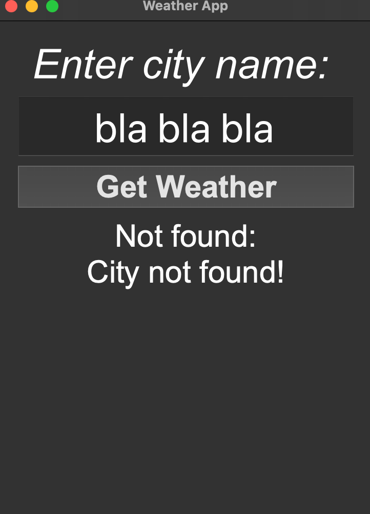
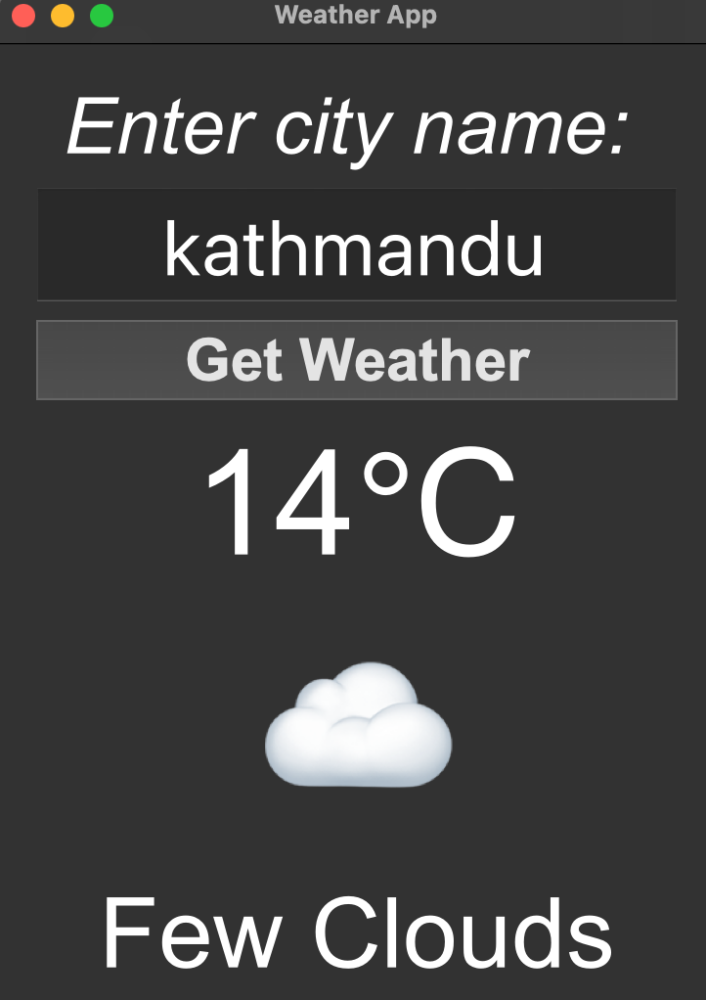

# PyProject-WeatherApp :)️

A simple Python Weather App with Python and  **PyQt5** that fetches live weather data using the OpenWeatherMap API and displays it in a user-friendly GUI.

---

## Features

- Get real-time weather updates.
- Search any city instantly.
- Sleek **PyQt5 GUI** interface.

---

# Weather Project - Requirements

This project uses PyQt5(we can also use PyQt6 or PySide6) to create a GUI weather application. Below are the requirements and dependencies needed to run the project successfully.

## Python Version
- Python 3.10 or higher

## Required Packages
The following Python packages are required:

- **PyQt5** or **PyQt6** or **PySide6**  
  Used for creating the GUI components.

- **qtwidgets**  
  Used to implement an animated toggle button (e.g., for Dark Mode).  

`qtwidgets` depends on the **`qtpy`** compatibility layer.  
So make sure to install both:

```bash
pip install qtwidgets qtpy
```

---

## UI

<div style="display: flex; justify-content: space-between;">
  
  
</div>

---

## Contributing

You are free to contribute! Any help or suggestions are welcome.

---
---

## Using OpenWeatherMap API

### **Sign up & Get API Key**
- Go to [https://openweathermap.org/api](https://openweathermap.org/api)
- Sign up for a free account and get your API key.

> **IMPORTANT**: API keys are sensitive and should **not** be exposed publicly. So, I stored the API key in a `.env` file for security.

#### **Steps to use .env for your API key**

1. **Create a .env file** in the project root:

```env
API_KEY = <Your openweathermap API key>
```

2. **Install python-dotenv** to load the .env file in Python:

```sh
pip install python-dotenv

OR

pip3 install python-dotenv
``` 

3. **Load the API key in your Python code**:

```python
import os
from dotenv import load_dotenv

# Load environment variables from .env
load_dotenv()

API_KEY = os.getenv("API_KEY")
```

4. **Make sure .env is in .gitignore** so your key is not pushed to GitHub:

```sh
# .gitignore
.env
```


---

## License

**MIT License** – free to use, modify, and share.
